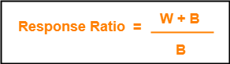

# implementation 
at first, we will determine the objects that they hold a meaningful idea from the project for example
<br>
- Task
- Resources
- Task_type(X,Y,Z)
- Status(ready, running, waiting)
- AlgoModel(FCFS, RR, SJF, HRRN)

and then we will implement Scheduler class to schedule the order of processes 
<br>
then we have the main idea of the Scheduling in ___run()__ method like below :

```python

    def _run(self, algo_type):
        task = self._chose_task(algo_type)

        if algo_type == AlgoModel.FCFS:
            self._run_FCFS(task)

        if algo_type == AlgoModel.RR:
            self._run_RR(task)

        if algo_type == AlgoModel.SJF:
            self._run_SJF(task)

        if algo_type == AlgoModel.HRRN:
            self._run_FCFS(task)

        self._free_resources(task)
        self._running_task_name = None
        self._update_queues()
        print("after resource free up : ________________")
        print(self)
```

in this code we will give a task by the given algorithm that can be any of FCFC , RR, SJF or HRRN algorithms 
and then by the priority we want in each algorithm we will extract a __Task__ 
<br>
and then we will run them by the algorithm we want
and then in the __run-somthing()__ methods we will print the status in each time unit 
<br>
and then when we call `free_resources()` we will free the resources we don't need anymore
<br>
then we will make the `runnig_task` into __None__ and then, we will update the ready Queue and waiting Queue
<br>
and after that we will print the status that we are in it
<br><br>
# tests :
with below tasks and resources we will run the project
<br>with assuming __arrival time__ is __zero__
- task-name, task-type, duration-time
  - t1 , x , 3
  - t2 , z , 6
  - t3 , x , 1
  - t4 , y , 10
- Recourse1, Resource2, Resource3
  - 2 , 2 , 2

# 1 - FCFS
at the __time = 0__ we will run the program and because __t2__ is Z task-type it has higher priority
and after that in __time = 6__ t2 will end and then, we chose
__t4__ to run for its Y task-type and int __time = 16__ we will run next task which it is __t1__
because that it's in the first of the list and in __time = 19__ we
will run next task __t3__ and in __time = 20__ the program will finish and the sequence of 
doing processes will be :<br>
- t2 => t4 => t1 => t4

# 2 - RR ( round robin )
like I said in previous algorithm, here we will sort the tasks by  their task-type priority too and then, 
we will see that the processes with more priority will be done sooner and with __QUANTUM = 2__ like below order:
- t2 => t4 => t1 => t3 => t2 => t4 => t1 => t2 => t4 => t4 => t4

# 3 - SJF 
in this algorithm beside the task-type priority we have another more important priority and that's __the shortest job first__
and with implementing it we will reach below tasks order:
- t3 => t1 => t2 => t4

as you see the shorter job will be done sooner 

# HRRN 
in here we have an algorithm to calculate priority and that's
<br>

<br>
with :
- W : current time 
- B : burst time of task

and with using the task_type priority and this algorithm we will reach to below task order:
- t2 => t3 => t1 => t4